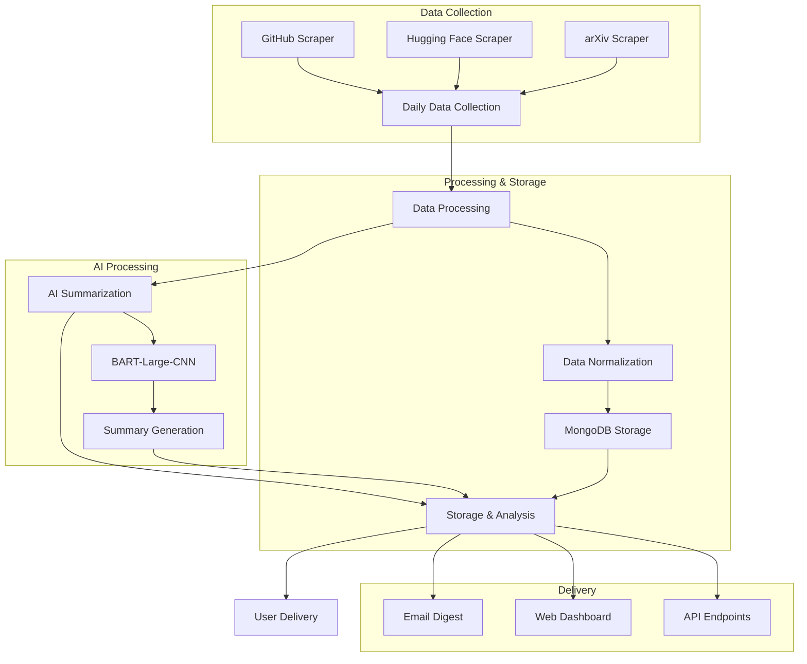

# Arkaiv - AI Tool Discovery Platform

Arkaiv is an automated platform that tracks, summarizes, and displays the latest AI tools and models from GitHub, Hugging Face, and arXiv papers. It helps researchers, developers, and enthusiasts stay up-to-date with the rapidly evolving field of artificial intelligence.

## 🚀 Features

### 🔍 Data Collection & Analysis
- **📊 Multi-Source Data Aggregation**
  - GitHub repositories (sorted by stars)
  - Hugging Face models (sorted by downloads)
  - arXiv papers (sorted by citations)
  - Daily web-scraping for newest releases

### 🤖 AI-Powered Summarization
- Automated summaries of new AI tools and models
- BART-Large-CNN powered text extraction
- Cached summaries for efficiency
- Fallback to OpenAI-3.5 Turbo when needed
- Automated daily digest generation and mailing service

### 📊 Dashboard & Visualization
- Real-time metrics tracking
- Source-specific filtering

### 📧 Digest System
- Daily email subscriptions
- Customizable digest preferences
- Email tracking and analytics
- Unsubscribe management

## 🛠️ Tech Stack

### Backend
- **Node.js** with Express
- **MongoDB** for data storage
- **Playwright** for web scraping

### Frontend
- **Vite** for build tooling
- **React** for UI components
- **React-Query** for data fetching

### AI & Processing
- **Hugging Face Inference API**
- **BART-Large-CNN** for summarization
- **OpenAI API** (fallback)

## 📦 Installation

### Prerequisites
- Node.js (v14 or higher)
- MongoDB Atlas account or local MongoDB instance
- Hugging Face API key
- OpenAI API key (optional, for fallback)

### Setup

1. Clone the repository:
   ```bash
   git clone https://github.com/tutankhAman/arkaiv.git
   cd arkaiv
   ```

2. Install dependencies:
   ```bash
   # Backend
   cd backend
   npm install
   
   # Frontend
   cd ../frontend
   npm install
   ```

3. Configure environment variables:
   Create `.env` files in both backend and frontend directories referring to `.env.example` file.

4. Install Playwright for web scraping:
   ```bash
   cd backend
   npx playwright install
   ```

## 🚀 Running the Project

### Development Mode

1. Start the backend server:
   ```bash
   cd backend
   npm run dev
   ```

2. Start the frontend development server:
   ```bash
   cd frontend
   npm run dev
   ```

### Production Mode

1. Build the frontend:
   ```bash
   cd frontend
   npm run build
   ```

2. Start the production server:
   ```bash
   cd backend
   npm start
   ```

## 📁 Project Structure

```
arkaiv/
├── backend/
│   ├── src/
│   │   ├── api/             # API routes and controllers
│   │   ├── config/          # Configuration files
│   │   ├── models/          # MongoDB schemas
│   │   ├── scrapers/        # Data collection modules
│   │   ├── digests/         # Digest generation
│   │   ├── scripts/         # Utility scripts
│   │   └── tests/           # Test suites
├── frontend/
│   ├── src/
│   │   ├── components/      # React components
│   │   ├── pages/          # Page components
│   │   ├── hooks/          # Custom hooks
│   │   ├── utils/          # Utility functions
│   │   └── styles/         # CSS modules
└── docs/                   # Documentation
```

## 🔄 Data Flow

The Arkaiv platform follows a streamlined data pipeline from collection to user delivery:



### Pipeline Stages

1. **Data Collection (Daily)**
   - Automated scraping of GitHub repositories
   - Hugging Face model updates
   - arXiv paper submissions
   - Rate-limited API calls to prevent overload

2. **Data Processing**
   - Normalization of data from different sources
   - Extraction of key metrics (stars, downloads, citations)
   - Metadata enrichment
   - Duplicate detection

3. **AI Summarization**
   - Text extraction from READMEs and abstracts
   - BART-Large-CNN powered summarization
   - Key feature extraction
   - Quality scoring

4. **Storage & Analysis**
   - MongoDB storage with optimized indexes
   - Trend analysis
   - Metric tracking
   - Historical data preservation

5. **User Delivery**
   - Daily email digests
   - Real-time web dashboard updates
   - REST API access
   - WebSocket notifications

## 🧪 Testing

Run the test suite:
```bash
# Backend tests
cd backend
npm test

# Frontend tests
cd frontend
npm test
```

## 📝 Contributing

1. Fork the repository
2. Create your feature branch (`git checkout -b feature/amazing-feature`)
3. Commit your changes (`git commit -m 'Add some amazing feature'`)
4. Push to the branch (`git push origin feature/amazing-feature`)
5. Open a Pull Request

## 📄 License

This project is licensed under the Apache License 2.0 - see the [LICENSE](LICENSE) file for details.

## 🤝 Support

For support, please open an issue in the GitHub repository or contact the maintainers.

## 📈 Roadmap

- [ ] Enhanced trend analysis
- [ ] Advanced search capabilities
- [ ] User authentication system
- [ ] API rate limiting improvements
- [ ] Additional data sources
- [ ] Mobile app development
